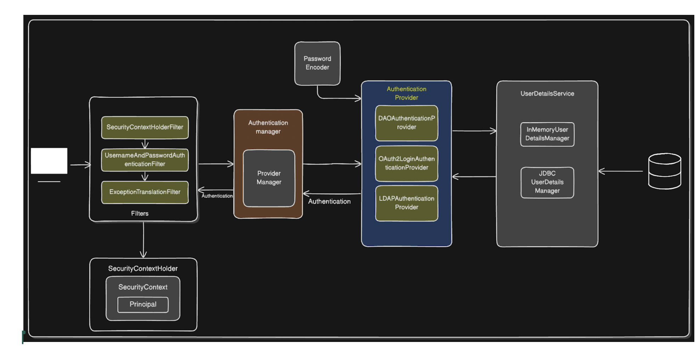

Authentication - Identity Access
Authorization - Access Control

Architecture of Spring Security

- When we add Spring Security dependency , A SecurityFilterChain is added to the Filter chain
- So thats the reason automatically all the endpoints gets security using a login page

- DelegatingFilterProxy - allows bridging between the Servler containers lifecycle and Spring ApplicationContext
- Inside DelegatingFilterProxy -> FilterChainProxy  -> SecurityFilterChain

For every type of authentication mechanisms like UserNamePassword , In Database , JWT , OAuth2 etc
- Spring provides different AuthenticationProviders 
- Like for Username and password - DAOAuthenticationProvider is used

Flow
- It will first go through the filter chain and then it will delegate the request to the AuthenticationProvider

- There might be multiple different authentication filters , to handle this 
- AuthenticationManager comes into play
- ProviderManager is the implementation of the AuthenticationManager

Now how will AuthenticationProvider will connect to database and retrieve details for correct username and password
- It has UserDetailsService which handles the entire retrieving logic from Database
- It has inMemoryUserDetailsManager and JDBCUserDetailsMangaer  

- AuthenticationManager has PasswordEncoder set up

- AuthenticationProvider after authentication will provide an object called Authentication and further provided to the filter

SecurityContext
- All the details of the authentication object containing (user details) which can be accessible across all the beans
- Principal Object

SecurityContextHolderFilter
- For handeling the session so that we dont have to login again and again

ExceptionTranslationFilter
- If any exceptions / error comes under the entire flow

