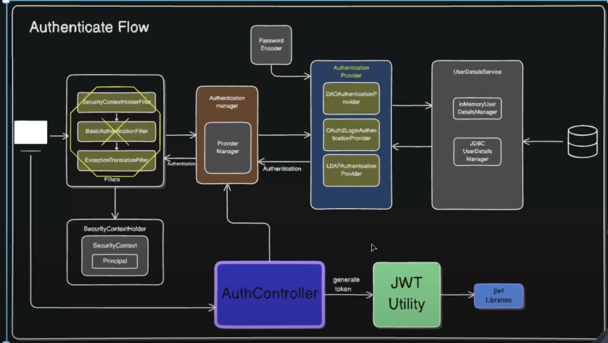

JWT - Has 3 parts - Header , Payload , Secret

- Here First we will skip all the auth filters and directly call the authenticate controller which will authenticate and then generate and provide the JWT token
- After that we can implement JWT filters to verify the JWT 

- Here AuthController can directly contact Authentication Manager instead of Filters doing it

- Add A Authenticate REst Controlller

@RestController
public class AuthController {
    
    @Autowired
    AuthenticationManager authenticationManager;

    @Autowired
    JWTUtil jwtUtil;

    @PostMapping("/authenticate")
    public String generateToken(@RequestBody AuthRequest authRequest){
        try {
            authenticationManager.authenticate(
                    new UsernamePasswordAuthenticationToken(authRequest.getUsername(), authRequest.getPassword()));

            return jwtUtil.generateToken(authRequest.getUsername());

        }catch (Exception e){
            throw e;
        }
    }
}

- Add /authenticate in the permitALL in the Configuration Class

- Now we have to add JWTUtil utility class , as Spring doesnt have functionality
- we will be using external libraries to generate validate jwt tokes 

- add this 3 dependecies
<dependency>
			<groupId>io.jsonwebtoken</groupId>
			<artifactId>jjwt-api</artifactId>
			<version>0.11.5</version>
</dependency>
<dependency>
			<groupId>io.jsonwebtoken</groupId>
			<artifactId>jjwt-impl</artifactId>
			<version>0.11.5</version>
			<scope>runtime</scope>
</dependency>
<dependency>
			<groupId>io.jsonwebtoken</groupId>
			<artifactId>jjwt-jackson</artifactId>
			<version>0.11.5</version>
			<scope>runtime</scope>
</dependency>

@Component
public class JWTUtil {

    private final String SECRET = "my-super-secret-key-that-is-long-enough-1234567890!@#";
    private final SecretKey key = Keys.hmacShaKeyFor(SECRET.getBytes());
    private final long EXPIRATION_TIME = 1000*60*60; //1hour
    
    
    public String generateToken(String username){
       return Jwts.builder()
                .setSubject(username)
                .setIssuedAt(new Date())
                .setExpiration(new Date(System.currentTimeMillis() + EXPIRATION_TIME))
                .signWith(key, SignatureAlgorithm.HS256)
                .compact();
    }

    public String extractUsername(String token){
        return extractClaims(token).getSubject();
    }

    private Claims extractClaims(String token) {
        return Jwts.parserBuilder()
                .setSigningKey(key)
                .build()
                .parseClaimsJws(token)
                .getBody();
    }

    public boolean validateToken(String username, UserDetails userDetails,String token) {
       return username.equals(userDetails.getUsername()) && !isTokenExpired(token);
    }

    private boolean isTokenExpired(String token) {
        return extractClaims(token).getExpiration().before(new Date());
    }
}

-----

- Add this JwtAuthFilter

@Component
public class JwtAuthFilter extends OncePerRequestFilter {
    @Autowired
    JWTUtil jwtUtil;
    
    
    @Autowired
    CustomUserDetailsService customUserDetailsService;
    
    
    @Override
    protected void doFilterInternal(HttpServletRequest request, HttpServletResponse response, FilterChain filterChain) throws ServletException, IOException {

        String authHeader = request.getHeader("Authorization");
        String token = null;
        String username = null;

        if(authHeader!=null && authHeader.startsWith("Bearer ")){
             token = authHeader.substring(7);
             username = jwtUtil.extractUsername(token);
        }

        if(username != null && SecurityContextHolder.getContext().getAuthentication()==null){
            UserDetails userDetails = customUserDetailsService.loadUserByUsername(username);

           if( jwtUtil.validateToken(username,userDetails,token)){
               UsernamePasswordAuthenticationToken authToken = new UsernamePasswordAuthenticationToken(userDetails, null, userDetails.getAuthorities());
               authToken.setDetails(new WebAuthenticationDetailsSource().buildDetails(request));
               SecurityContextHolder.getContext().setAuthentication(authToken);
           }
        }

        
        filterChain.doFilter(request,response);
    }
}

---

- Add this filter in the configuration

@Configuration
@EnableWebSecurity
public class SecurityConfig {
    @Autowired
    JwtAuthFilter jwtAuthFilter;
    
    
    @Bean
    public SecurityFilterChain filterChain(HttpSecurity http) throws Exception {
        http.csrf(AbstractHttpConfigurer::disable)
                .authorizeHttpRequests(auth->
                        auth.requestMatchers("/authenticate").permitAll()
                                .requestMatchers(HttpMethod.GET,"/weather/**").hasAuthority(Permissions.WEATHER_READ.name())
                                .requestMatchers(HttpMethod.POST,"/weather/**").hasAuthority(Permissions.WEATHER_WRITE.name())
                                .requestMatchers(HttpMethod.DELETE,"/weather/**").hasAuthority(Permissions.WEATHER_DELETE.name())
                                .anyRequest().authenticated());
        http.addFilterBefore(jwtAuthFilter, UsernamePasswordAuthenticationFilter.class);
        return http.build();
    }
    
    
    @Bean
    public UserDetailsService userDetailsService(){
        return new CustomUserDetailsService();
    }
    @Bean
     public PasswordEncoder passwordEncoder(){
        return new BCryptPasswordEncoder();
     }
    @Bean
    public AuthenticationManager authenticationManager(UserDetailsService userDetailsService,
                                                       PasswordEncoder passwordEncoder){
        DaoAuthenticationProvider daoAuthenticationProvider = new DaoAuthenticationProvider();
        daoAuthenticationProvider.setUserDetailsService(userDetailsService);
        daoAuthenticationProvider.setPasswordEncoder(passwordEncoder);

        return new ProviderManager(daoAuthenticationProvider);
    }
}