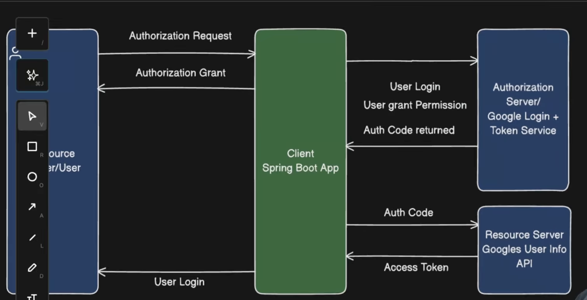

OAuth 2 - Its an authorization framework that allows a third party application to obtain limited access to users protected resources without exposing their credentials 

Create A New Project

- Add Spring web , Spring Security and OAuth2 Client

Adding OAuth2 client 
- add a OAuthLoginAuthenticationFilter 

@Configuration
public class SecurityConfig {

    @Bean
    public SecurityFilterChain securityFilterChain(HttpSecurity http) throws Exception {
        http
                .authorizeHttpRequests(requests -> requests
                        .requestMatchers("/api/public").permitAll()
                        .anyRequest().authenticated()
                )
                .oauth2Login(Customizer.withDefaults());

        return http.build();
    }
}

spring.security.oauth2.client.registration.google.client-id=clientid
spring.security.oauth2.client.registration.google.client-secret=clientsecret
spring.security.oauth2.client.registration.google.scope=openid,profile,email

spring.security.oauth2.client.provider.google.authorization-uri=https://accounts.google.com/o/oauth2/v2/auth
spring.security.oauth2.client.provider.google.token-uri=https://oauth2.googleapis.com/token
spring.security.oauth2.client.provider.google.user-info-uri=https://www.googleapis.com/oauth2/v3/userinfo

- Go to Google Developers Portal , Generate cliend Id and client secret 